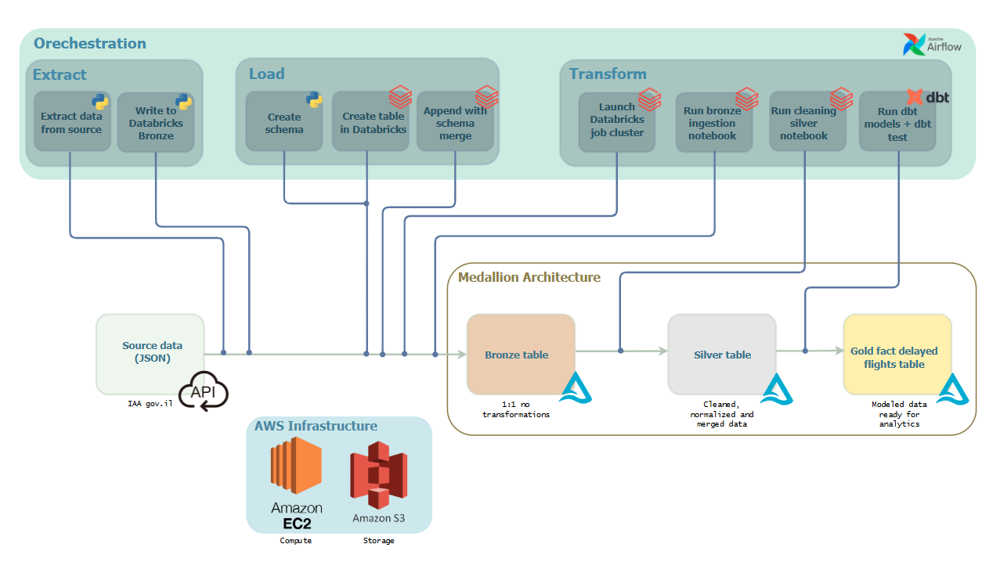
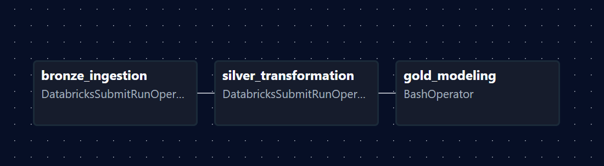

# Airport Data Pipeline

A production-grade data engineering project implementing a medallion architecture to process real-time flight data from the Israeli Airport Authority API using Apache Airflow, Databricks, and dbt.



## Project Overview

This pipeline ingests, transforms, and models approximately **3000 daily flights** through a three-tier medallion architecture (Bronze → Silver → Gold), providing clean, analytical-ready data for flight delay analysis and operational insights.

### Key Features

- **Real-time API Integration**: Automated daily ingestion from Israeli Airport Authority public API
- **Medallion Architecture**: Industry-standard Bronze/Silver/Gold data layering
- **Incremental Processing**: Smart merge strategies to handle updates and late-arriving data
- **Data Quality**: Built-in validation, deduplication, and dbt testing
- **Cloud-Native**: Runs on Databricks (AWS EC2/S3) with Delta Lake storage format
- **Containerized Orchestration**: Apache Airflow running in Docker Compose

---

## Architecture

### Airflow DAG Visualization



*The DAG orchestrates three main tasks: Bronze ingestion → Silver transformation → Gold modeling*

### Data Flow

```
Israeli Airport Authority API (JSON)
    ↓
Bronze Layer (Raw Data)
    ├─ flights_bronze.raw_flights
    ├─ Schema: 20+ raw API fields
    └─ Strategy: Append-only with schema evolution
    ↓
Silver Layer (Cleaned & Normalized)
    ├─ flights_silver.flights_clean
    ├─ Transformations: Standardization, type conversion, deduplication
    └─ Strategy: MERGE on composite key (flight_number + airline_code + current_date + arrival_departure)
    ↓
Gold Layer (Analytics-Ready)
    ├─ flights_gold.fact_delayed_flights
    ├─ Models: Delay calculations, fact tables
    └─ Tool: dbt-databricks
```

### Technology Stack

| Layer | Technology | Purpose |
|-------|-----------|---------|
| **Orchestration** | Apache Airflow 3.1.6 | Workflow scheduling and monitoring |
| **Compute** | Databricks on AWS EC2 | Distributed Spark processing |
| **Storage** | Delta Lake on S3 | ACID transactions, time travel, versioning |
| **Transformation** | PySpark + dbt-databricks | Data cleaning and modeling |
| **Containerization** | Docker Compose | Local development and deployment |

---

## Project Structure

```
airport-data-pipeline/
├── dags/
│   └── airport_pipeline_dag.py          # Airflow DAG orchestrating all tasks
├── bronze/
│   └── bronze_flights_api.ipynb         # API ingestion to Bronze layer
├── silver/
│   └── silver_flights_notebook.ipynb    # Cleaning & normalization to Silver
├── airport_dbt/
│   ├── models/
│   │   ├── fact_delayed_flights.sql     # Gold layer dbt model
│   │   └── sources.yml                  # Source definitions
│   ├── profiles.yml                     # Databricks connection config
│   └── dbt_project.yml                  # dbt project settings
├── config/
│   └── airflow.cfg                      # Airflow configuration
├── docker-compose.yaml                  # Multi-container Airflow setup
├── dockerfile                           # Custom Airflow image with Spark/dbt
├── requirements.txt                     # Python dependencies
└── README.md
```

---

## Getting Started

### Prerequisites

- Docker Desktop (with Docker Compose)
- Databricks workspace on AWS
- Git
- 4GB+ RAM for Airflow services

### Environment Setup

1. **Clone the repository**
   ```bash
   git clone https://github.com/yourusername/airport-data-pipeline.git
   cd airport-data-pipeline
   ```

2. **Create `.env` file** in project root:
   ```bash
   # Airflow
   AIRFLOW_UID=50000
   _AIRFLOW_WWW_USER_USERNAME=airflow
   _AIRFLOW_WWW_USER_PASSWORD=airflow

   # Databricks
   DATABRICKS_HOST=your-workspace.cloud.databricks.com
   DATABRICKS_HTTP_PATH=/sql/1.0/warehouses/your-warehouse-id
   DATABRICKS_CLUSTER_ID=your-cluster-id
   DATABRICKS_DBT_ACCESS_KEY=your-databricks-token

   # Notebook Paths
   BRONZE_PATH=/Workspace/Users/your-email/bronze_flights_api
   SILVER_PATH=/Workspace/Users/your-email/silver_flights_notebook
   ```

3. **Upload Notebooks to Databricks**
   - Upload `bronze/bronze_flights_api.ipynb` to your Databricks workspace
   - Upload `silver/silver_flights_notebook.ipynb` to your Databricks workspace
   - Update paths in `.env` to match your workspace structure

4. **Initialize Airflow**
   ```bash
   docker-compose up airflow-init
   ```

5. **Start Airflow services**
   ```bash
   docker-compose up -d
   ```

6. **Access Airflow UI**
   - URL: http://localhost:8080
   - Username: `airflow` (or from `.env`)
   - Password: `airflow` (or from `.env`)

### Running the Pipeline

1. **Set up Databricks Connection in Airflow**
   - Navigate to Admin → Connections
   - Add connection ID: `databricks_default`
   - Connection Type: `Databricks`
   - Host: Your Databricks workspace URL
   - Token: Your personal access token

2. **Add Airflow Variable**
   - Navigate to Admin → Variables
   - Add key: `DATABRICKS_DBT_ACCESS_KEY`
   - Value: Your Databricks token

3. **Trigger the DAG**
   - Go to DAGs page
   - Find `airport_pipeline`
   - Click the play button to trigger manually
   - Monitor progress in the Graph view

---

## Pipeline Details

### Bronze Layer: Data Ingestion

**Notebook**: `bronze_flights_api.ipynb`

- Fetches flight data from Israeli Airport Authority API
- Adds metadata columns: `ingestion_timestamp`, `source_file`
- Writes to Delta table with schema merge enabled (handles API changes)
- Strategy: **Append-only** to maintain full history

```python
df_bronze.write \
    .mode("append") \
    .format("delta") \
    .option("mergeSchema", "true") \
    .saveAsTable("flights_bronze.raw_flights")
```

### Silver Layer: Cleaning & Normalization

**Notebook**: `silver_flights_notebook.ipynb`

**Transformations Applied:**
- Rename airport code column names (CHAORD → arrival_departure, CHFLTN → flight_number)
- Standardize values (A/D → arrival/departure)
- Trim whitespace from all string columns
- Uppercase codes for consistency (airline_code, airport_code, status)
- Convert timestamp strings to proper timestamp types
- Add derived columns (flight_date for partitioning)
- Deduplicate based on composite key

**Merge Strategy:**
```sql
MERGE INTO flights_silver.flights_clean
USING incoming_flights
ON target.flight_number = source.flight_number
   AND target.airline_code = source.airline_code
   AND target.arrival_departure = source.arrival_departure
   AND target.flight_date = source.flight_date
WHEN MATCHED THEN UPDATE
WHEN NOT MATCHED THEN INSERT
```

**Composite Key Rationale:**
- Same flight operates daily (need date)
- Same flight number can be both arrival AND departure (need direction)
- Ensures uniqueness while allowing updates for status changes

### Gold Layer: Analytics Modeling

**dbt Model**: `fact_delayed_flights.sql`

- Calculates delay in minutes for landed flights
- Incremental materialization for efficiency
- Only processes new/updated records
- Creates fact table optimized for delay analysis

**Sample Query Output:**
```sql
SELECT 
    airline_name,
    AVG(delay_minutes) as avg_delay,
    COUNT(*) as total_delayed_flights
FROM flights_gold.fact_delayed_flights
WHERE delay_minutes > 0
GROUP BY airline_name
ORDER BY avg_delay DESC;
```

---

## Data Quality & Testing

### Built-in Validations

**Bronze Layer:**
- Schema evolution handling (mergeSchema)
- API response validation

**Silver Layer:**
- Null checks on merge key fields
- Deduplication logic (keep most recent record)
- Assertions for data integrity

**Gold Layer:**
- dbt tests (via `dbt test`)
- Data freshness checks
- Referential integrity

### Running Tests

```bash
# SSH into Airflow worker
docker exec -it <container-id> bash

# Navigate to dbt project
cd /opt/airflow/airport_dbt

# Run dbt tests
dbt test --profiles-dir /opt/airflow/config
```

---

## Monitoring & Observability

### Airflow UI
- DAG run history and status
- Task logs and error messages
- Execution duration tracking
- Retry behavior monitoring

### Databricks
- Notebook execution logs
- Spark job metrics
- Delta Lake version history
- Query performance insights

---

## Development & Customization

### Adding New Transformations

1. **Bronze → Silver**: Modify `silver_flights_notebook.ipynb`
2. **Silver → Gold**: Add new dbt models in `airport_dbt/models/`
3. Test locally with dbt: `dbt run --select your_model`

### Extending the Pipeline

**Add new data sources:**
1. Create new Bronze ingestion notebook
2. Add Databricks task to DAG
3. Create corresponding Silver cleaning logic
4. Build dbt models for analytics

**Modify schedule:**
```python
# In airport_pipeline_dag.py
schedule=None,  # Manual trigger only
# OR
schedule='0 2 * * *',  # Daily at 2 AM
```

---

## Troubleshooting

### Common Issues

**Issue**: Airflow can't connect to Databricks
- **Solution**: Verify `databricks_default` connection settings
- Check token hasn't expired
- Ensure cluster is running

**Issue**: dbt models fail
- **Solution**: Check Databricks token in Airflow variables
- Verify `profiles.yml` connection settings
- Ensure Silver tables exist before running Gold models

**Issue**: Schema merge errors
- **Solution**: Check for incompatible data type changes
- Review Delta Lake transaction logs
- Use `DESCRIBE HISTORY` to debug

### Viewing Logs

```bash
# Airflow task logs
docker-compose logs airflow-worker

# Databricks notebook logs
# Available in Databricks workspace UI under notebook runs
```

---

## Performance Optimization

### Current Optimizations

- **Incremental dbt models**: Only process new/updated records
- **Delta Lake MERGE**: Efficient upserts vs full rewrites
- **Partitioning**: By `flight_date` for better query performance
- **Deduplication**: Window functions before merge reduce data volume


---

## Data Dictionary

### Bronze Layer: `flights_bronze.raw_flights`

Raw API fields with minimal transformation.

### Silver Layer: `flights_silver.flights_clean`

| Column | Type | Description |
|--------|------|-------------|
| arrival_departure | STRING | Flight direction: 'arrival' or 'departure' |
| flight_number | STRING | Flight number (e.g., '235') |
| airline_code | STRING | IATA airline code (e.g., 'LY', 'AC') |
| flight_date | DATE | Date of scheduled landing |
| origin_airport_code | STRING | IATA airport code (arrivals only) |
| origin_city_en | STRING | Origin city in English |
| origin_country_he | STRING | Origin country in Hebrew |
| airline_name | STRING | Full airline name |
| actual_landing_time | TIMESTAMP | Actual landing timestamp |
| scheduled_landing_time | TIMESTAMP | Scheduled landing timestamp |
| status_en | STRING | Flight status (LANDED, DELAYED, etc.) |
| terminal | BIGINT | Terminal number |
| updated_at | TIMESTAMP | Last update timestamp |

### Gold Layer: `flights_gold.fact_delayed_flights`

| Column | Type | Description |
|--------|------|-------------|
| flight_id | STRING | Composite key (airline+flight+direction+date) |
| flight_number | STRING | Flight number |
| airline_code | STRING | IATA airline code |
| airline_name | STRING | Full airline name |
| flight_date | DATE | Date of flight |
| scheduled_landing_time | TIMESTAMP | Scheduled landing |
| actual_landing_time | TIMESTAMP | Actual landing |
| delay_minutes | INTEGER | Delay in minutes (null if on-time) |

---

## Contributing

This is a portfolio project, but suggestions and improvements are welcome!

1. Fork the repository
2. Create a feature branch (`git checkout -b feature/improvement`)
3. Commit changes (`git commit -am 'Add new feature'`)
4. Push to branch (`git push origin feature/improvement`)
5. Open a Pull Request

---

## License

This project is licensed under the MIT License - see the [LICENSE](LICENSE) file for details.

---
